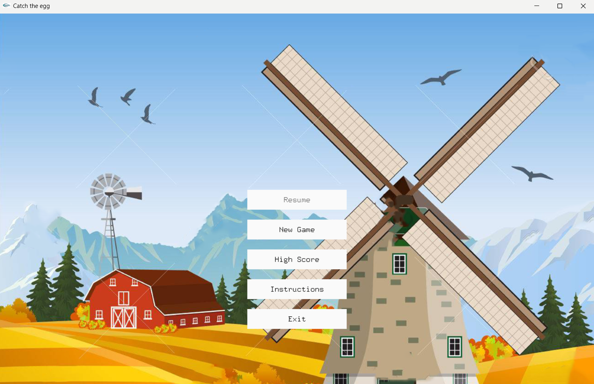
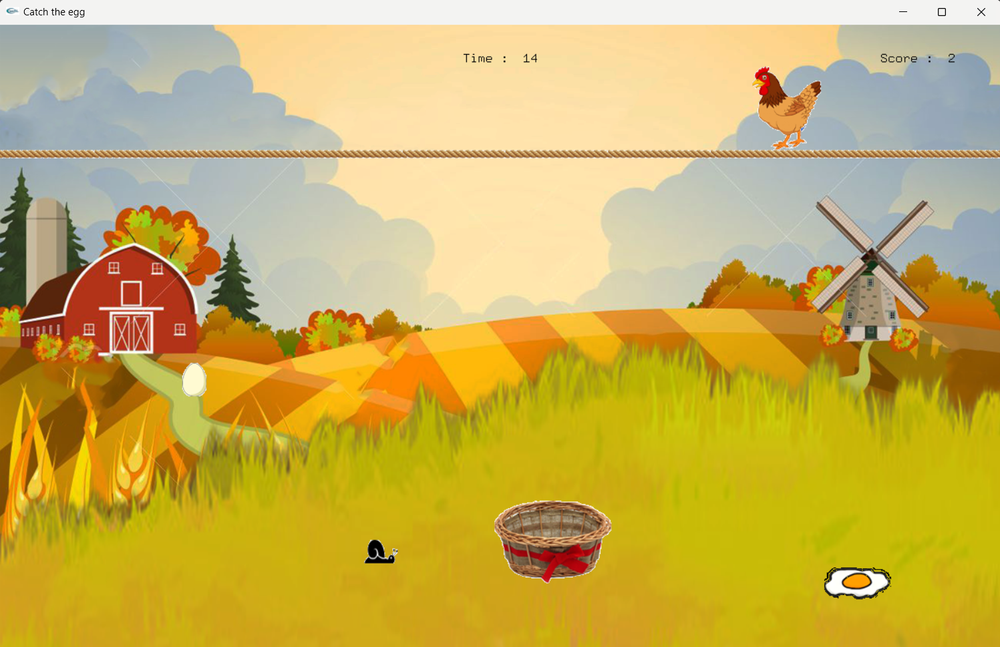

# Catch-the-Egg
CSE 102 IGraphics Project

# How to run:
1. Open command prompt on Catch the Egg directory.
2. Run the command 'g++ -IOpenGL\include -w -c "Catch the egg.cpp" -o "Catch the egg.o"'
3. Run the command 'g++ -LOpenGL\lib "Catch the egg.o" -o "Catch the egg.exe" -lGlaux -lGLU32 -lglui32 -lglut32 -lOPENGL32 -lgdi32'
4. Run "Catch the egg.exe" from Catch the Egg directory.

# Project Screenshots:

